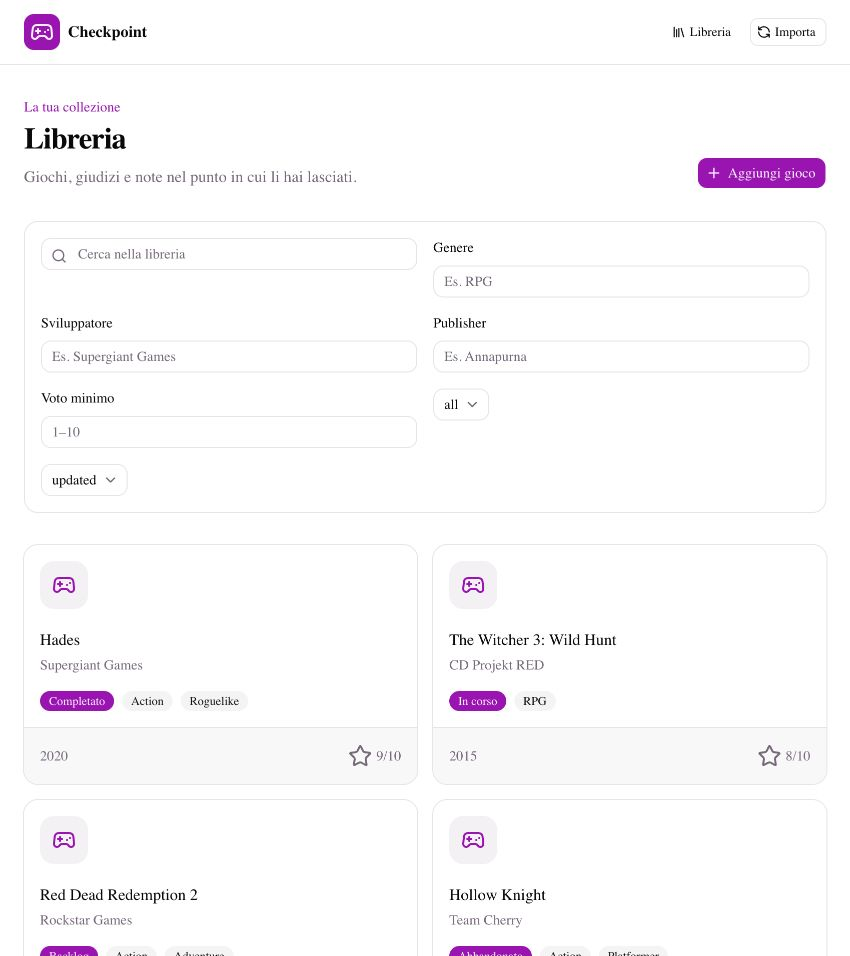
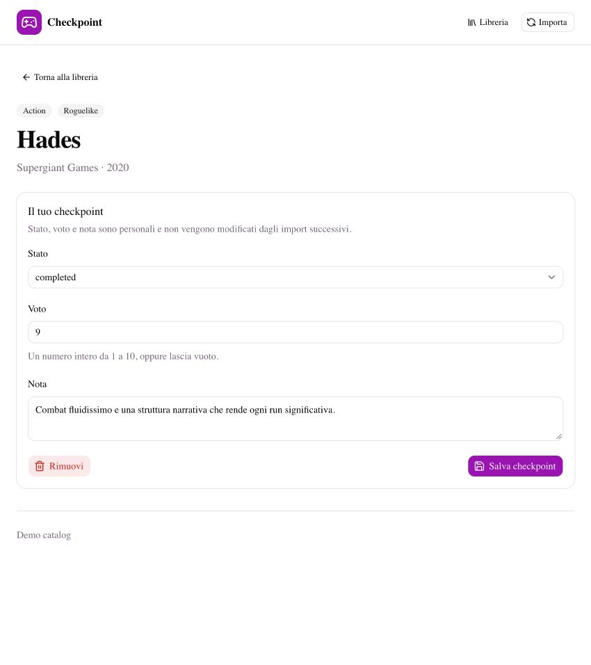
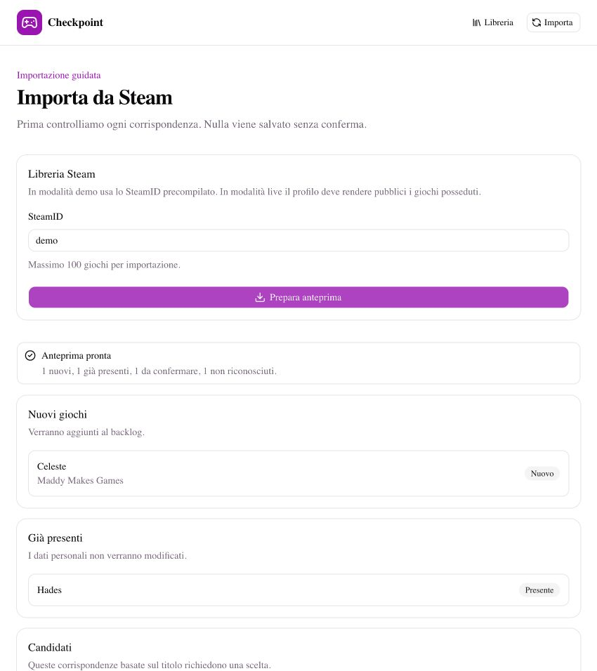
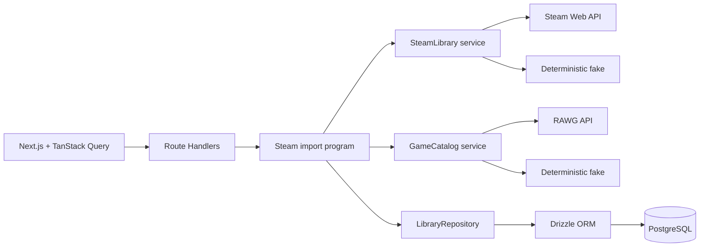

# Checkpoint

Checkpoint è un diario personale per videogiochi. Importa una libreria Steam, riconcilia i titoli con un catalogo esterno e permette di tenere stato, voto e note senza sovrascriverli agli import successivi.

Il progetto nasce come prova tecnica incentrata su [Effect](https://effect.website/). La parte interessante non è il CRUD: è trasformare dati esterni incompleti in una preview esplicita, parzialmente fallibile e idempotente.

## Demo

La configurazione predefinita non richiede credenziali né rete. Usa lo SteamID `demo` nella pagina `/import` per vedere corrispondenze esatte, un gioco già presente, un candidato che richiede conferma, un gioco non riconosciuto e un errore isolato.







## Avvio rapido

Servono Node.js 20 o successivo, pnpm e Docker con Compose.

```bash
pnpm install --frozen-lockfile
pnpm setup
pnpm dev
```

Apri [http://localhost:3000](http://localhost:3000). `pnpm setup` crea `.env` da `.env.example`, avvia PostgreSQL, applica le migration e carica cinque voci dimostrative. Il seed è ripetibile.

```bash
pnpm test       # sei test del dominio e del workflow
pnpm typecheck
pnpm lint
pnpm check      # lint + typecheck + test
pnpm build
```

## Modalità live e API key

Le credenziali restano esclusivamente in `.env`, ignorato da Git. Le chiavi gratuite non vanno committate: possono essere usate da terzi per consumare la quota o generare traffico attribuito al proprietario.

### RAWG

1. Crea o accedi a un account su [RAWG](https://rawg.io/login).
2. Apri [RAWG API](https://rawg.io/apidocs) e genera una API key.
3. Rispetta i termini e l'attribuzione richiesta da RAWG.
4. Configura:

```env
CATALOG_PROVIDER=live
RAWG_API_KEY=la-tua-chiave
```

### Steam

1. Accedi a Steam.
2. Visita [Steam Web API Key](https://steamcommunity.com/dev/apikey).
3. Inserisci il dominio richiesto da Steam e accetta i termini.
4. Configura:

```env
STEAM_PROVIDER=live
STEAM_API_KEY=la-tua-chiave
```

`GetOwnedGames` funziona soltanto se il profilo e i dettagli dei giochi posseduti sono visibili. Checkpoint usa SteamID64, non il nome pubblico del profilo. RAWG e Steam possono essere attivati indipendentemente.

## Funzionalità

- libreria single-user con backlog, in corso, completato e abbandonato;
- voto intero opzionale da 1 a 10 e una nota personale;
- ricerca e aggiunta manuale dal catalogo;
- filtri per titolo, stato e metadati, con ordinamento;
- import Steam in due passaggi, massimo 100 giochi e quattro riconciliazioni concorrenti;
- corrispondenza esatta tramite Steam App ID e candidati per titolo mai salvati automaticamente;
- reimportazioni che non modificano dati personali;
- adapter live e fake per entrambe le API.

## Architettura



Il codice applicativo è organizzato per capacità in `src/modules`. Le dipendenze tecniche vivono in `src/infrastructure`. Il vocabolario è in [`CONTEXT.md`](CONTEXT.md) e la specifica verificata dalla review è in [`docs/spec.md`](docs/spec.md).

### Come viene usato Effect

- `Context.Tag` definisce `GameCatalog`, `SteamLibrary` e `LibraryRepository`.
- `Layer` sceglie adapter live, fake o di test senza modificare il workflow.
- `Schema` decodifica input HTTP, configurazione e risposte esterne.
- `Data.TaggedError` distingue errori Steam, catalogo, database e voci mancanti.
- `Effect.forEach` limita la riconciliazione a quattro giochi concorrenti.
- `Schedule` ritenta le richieste RAWG fallite con backoff e limite.
- `Effect.catchTag` trasforma il fallimento di un singolo gioco in un risultato parziale.

TanStack Query gestisce soltanto query, mutation e invalidazione nel browser. Retry, concorrenza, configurazione ed errori server restano in Effect. Drizzle è l'unica astrazione SQL; i repository restituiscono `Effect`.

## Decisioni e compromessi

- Nessuna autenticazione o tabella utenti: il prototipo è esplicitamente single-user.
- La preview non viene persistita. Se si chiude la pagina, viene rigenerata.
- Nessun job in background: il limite di 100 giochi mantiene prevedibile una richiesta HTTP.
- Il tempo giocato non viene importato, perché introdurrebbe sincronizzazione e più piattaforme.
- I metadati vengono salvati localmente e aggiornati quando il gioco ricompare in una ricerca o importazione.
- Generi e aziende sono relazioni SQL, non JSON, perché sono filtri di prima classe.

## Test

I test osservano interfacce pubbliche. Verificano classificazione e fallimenti parziali della preview, limite dell'importazione, indisponibilità Steam, conferma selettiva e vincoli del voto. I layer fake sostituiscono API e repository senza mockare funzioni interne.

## Uso dell'AI e delle skill

Ho usato Codex come partner di progettazione e implementazione. Le decisioni sono state messe sotto pressione prima di scrivere codice; ho poi controllato diff, test, typecheck, lint e comportamento dell'app.

Skill utilizzate:

- `grill-with-docs`, `grilling` e `domain-modeling` per restringere lo scope e fissare il linguaggio in `CONTEXT.md`;
- `shadcn` per leggere la configurazione, consultare la documentazione aggiornata e aggiungere componenti dal registry ufficiale;
- `implement` e `tdd` per sviluppare a slice verticali partendo dal workflow d'importazione;
- `code-review` per la verifica finale separata tra standard del repository e specifica.

L'AI ha aiutato a consultare documentazione, proporre alternative, generare porzioni di codice e casi di test. Ho mantenuto la responsabilità delle scelte, escluso funzionalità non giustificate e verificato ogni comando. `docs/spec.md`, `CODING_STANDARDS.md` e il commit di base rendono la review riproducibile.

## Cosa ho imparato

Il valore principale di Effect, in questo progetto, è rendere espliciti dipendenze e fallimenti. La stessa importazione gira con servizi live, fake e di test; un errore locale diventa un dato della preview invece di interrompere implicitamente l'intera operazione.

Con più tempo approfondirei interruzioni e scope durante richieste lunghe, test d'integrazione dei repository contro Postgres e una coda persistente per librerie molto grandi. Non aggiungerei funzioni social prima di aver risolto bene questi aspetti.
