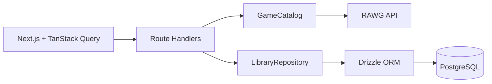

# Checkpoint

Checkpoint è un diario personale per videogiochi. Cerchi un gioco nel catalogo, lo aggiungi alla libreria e annoti stato, voto e nota.

## Perché questo progetto

Sono appassionato di videogiochi e ho scelto un dominio familiare per iniziare a studiare [Effect](https://effect.website/). Cercare in un catalogo esterno, validare dati e salvare una voce personale mi sembravano operazioni adatte a esplorare la libreria in un'applicazione concreta.

Prima di questo progetto conoscevo Effect solo di nome, soprattutto per la gestione degli errori. L'obiettivo era costruire un piccolo progetto che la utilizzasse e rendere visibile il mio percorso di apprendimento attraverso il codice e le scelte tecniche.

Ho mantenuto il dominio contenuto per dedicare attenzione a Effect e alla separazione tra contratti dei servizi e adapter. L'app è un prototipo single-user; autenticazione e integrazioni aggiuntive sono rimaste fuori dal perimetro.

<table>
  <tr>
    <td width="50%">
      
    </td>
    <td width="50%">
      
    </td>
  </tr>
</table>

## Avvio rapido

Servono Node.js 22, pnpm e Docker avviato con Docker Compose.

```bash
pnpm install --frozen-lockfile
pnpm setup
pnpm dev
```

Apri [http://localhost:3000](http://localhost:3000). `pnpm setup` crea `.env` con i valori locali se manca, avvia PostgreSQL su `localhost:5433`, applica le migration e inserisce quattro voci dimostrative se la libreria è vuota. Senza chiave RAWG, il catalogo demo permette di cercare, aggiungere giochi e aggiornare i metadati senza servizi esterni; le copertine dimostrative sono incluse nel repository.

Puoi rilanciare `pnpm setup`: conserva il tuo `.env` e, se la libreria contiene già voci, non reinserisce i giochi eliminati e non modifica stato, voto o nota. Se svuoti completamente la libreria, il setup inserisce nuovamente i dati demo. Il database rimane attivo e conserva i dati in un volume Docker. Per fermarlo usa `docker compose stop postgres`.

Per usare RAWG anche in locale, aggiungi `RAWG_API_KEY` a `.env`. Per usare Supabase, configura le connessioni come descritto sotto: il setup applica le migration e verifica la connessione, senza inserire dati demo. Gli URL PostgreSQL diversi dal container del progetto e da Supabase vengono rifiutati. Se hai già un `.env` Supabase, il setup continua a usare quello; per passare al database locale imposta `DATABASE_URL` come in `.env.example` e svuota `DATABASE_MIGRATION_URL`.

```bash
pnpm test
pnpm typecheck
pnpm lint
pnpm check      # lint + typecheck + test
pnpm build
```

### Giochi ricercabili nel catalogo demo

Con il database locale e `RAWG_API_KEY` assente o vuota, puoi cercare questi 20 giochi:

- Baldur's Gate III
- Celeste
- Cyberpunk 2077
- Dark Souls III
- Dead Cells
- Disco Elysium
- Elden Ring
- Hades
- Hollow Knight
- Outer Wilds
- Portal
- Portal 2
- Red Dead Redemption 2
- Sekiro: Shadows Die Twice
- Slay the Spire
- Stardew Valley
- Terraria
- The Elder Scrolls V: Skyrim
- The Witcher 3: Wild Hunt
- Undertale

La ricerca trova anche parti del titolo e ignora maiuscole e minuscole. Per esempio, `portal` restituisce Portal e Portal 2, `souls` trova Dark Souls III e `witcher` trova The Witcher 3: Wild Hunt. I giochi hanno copertine dimostrative locali e possono essere aggiunti alla libreria o aggiornati senza chiamare RAWG.

L'elenco è definito in [`src/modules/catalog/demo-data.ts`](src/modules/catalog/demo-data.ts). `GameCatalogDemo` fornisce il servizio `GameCatalog` tramite un `Layer` di Effect: ricerca e dettaglio usano lo stesso contratto dell'adapter RAWG, con dati locali deterministici.

## Struttura del progetto

L'albero mostra le cartelle principali e alcuni file da cui iniziare la lettura.

```text
checkpoint/
├── src/
│   ├── app/                       Pagine Next.js e Route Handler HTTP
│   │   └── api/                   Endpoint del catalogo e della libreria
│   ├── modules/
│   │   ├── catalog/               Modelli, contratto GameCatalog, adapter RAWG e fake
│   │   └── library/               Modelli, contratto LibraryRepository e adapter
│   │                              PostgreSQL e in memoria, filtri e test didattici
│   ├── infrastructure/            Configurazione, composizione dei Layer e confine HTTP
│   │   └── database/              Client PostgreSQL e schema Drizzle
│   ├── components/                Interfaccia dell'applicazione
│   │   └── ui/                    Componenti shadcn/ui
│   ├── lib/                       Client API e utilità di navigazione
│   └── styles/                    Stili globali e tipografia
├── drizzle/                       Migration SQL e metadati Drizzle
├── scripts/                       Setup e comandi per PostgreSQL locale e Supabase
├── compose.yaml                   PostgreSQL locale con volume persistente
├── certs/                         Certificato CA per la connessione Supabase
├── docs/
│   ├── spec.md                    Specifica dei flussi applicativi
│   ├── adr/                       Decisioni sul perimetro
│   ├── agents/                    Convenzioni per il lavoro degli assistenti AI
│   ├── brand/                     Materiali grafici
│   └── screenshots/               Immagini dell'applicazione
├── .agents/skills/                Skill installate nel progetto
├── AGENTS.md                      Istruzioni di repository per gli assistenti AI
├── CONTEXT.md                     Vocabolario del dominio
├── CODING_STANDARDS.md            Convenzioni di codice
├── PRODUCT.md                     Indicazioni di prodotto
├── DESIGN.md                      Indicazioni per l'interfaccia
└── .env.example                   Variabili necessarie per l'avvio
```

Per seguire Effect nel codice, partirei da [`src/modules/library/service.ts`](src/modules/library/service.ts), che dichiara il contratto e gli errori del repository, e dal [test con l'adapter in memoria](src/modules/library/repository-memory.test.ts), che mostra come usarlo. Il [Route Handler della libreria](src/app/api/library/route.ts) compone catalogo e repository nel flusso di aggiunta; [`app-layer.ts`](src/infrastructure/app-layer.ts) fornisce le implementazioni live.

## Architettura


```mermaid
flowchart LR
  UI[Next.js + TanStack Query] --> API[Route Handlers]
  API --> Catalog[GameCatalog]
  API --> Library[LibraryRepository]
  Catalog --> Rawg[RAWG API]
  Library --> Drizzle[Drizzle ORM]
  Drizzle --> Postgres[(PostgreSQL)]
```

I modelli, i contratti dei servizi e i relativi adapter sono organizzati in `src/modules`. `src/infrastructure` contiene la configurazione, la composizione dei `Layer`, il confine HTTP e l'accesso al database.

### Come viene usato Effect

- `Context.Tag` dichiara `GameCatalog` e `LibraryRepository`
- `Layer` fornisce gli adapter live all'app e quelli fake o in memoria ai test
- `Schema` valida gli input HTTP e le risposte RAWG
- `Data.TaggedError` distingue errori del catalogo, del database e voci mancanti
- `Config` legge la configurazione e `Redacted` rappresenta i segreti.

TanStack Query gestisce query, mutation e invalidazione della cache nel browser. I programmi Effect gestiscono i flussi del server e le loro dipendenze; il client usa anche `Schema` per validare le risposte API. Drizzle gestisce le query SQL; le interfacce dei repository restituiscono valori `Effect`.

Il dettaglio del catalogo è una lettura: può mostrare una copertina mancante senza richiedere PostgreSQL o aggiornare uno snapshot. L'aggiunta compone il caricamento da RAWG con `LibraryRepository.addManualGame`; l'adapter PostgreSQL salva snapshot e voce personale nella stessa transazione e restituisce l'ID della voce. La transazione appartiene all'adapter perché `Effect` descrive la sequenza e gli errori, ma non rende atomiche da solo due scritture SQL.

Aggiungere di nuovo un gioco già presente restituisce la stessa voce senza cambiare i metadati salvati. Nella scheda della libreria, **Aggiorna dati del gioco** ricarica esplicitamente i metadati RAWG e conserva stato, voto e nota.

La politica di filtri e ordinamento vive in `src/modules/library/query.ts`. Browser e due adapter la usano con le stesse regole; l'adapter PostgreSQL carica le voci e i metadati con tre query, indipendentemente dal numero di voci.

### Servizi e adapter

I file `service.ts` dichiarano cosa possono fare `GameCatalog` e `LibraryRepository` e quali errori possono restituire. Le implementazioni sono negli adapter: `rawg-live.ts` chiama RAWG, `repository-live.ts` usa Drizzle e PostgreSQL, `repository-memory.ts` mantiene lo stato in memoria a scopo di test.

Un programma richiede il servizio attraverso `Context.Tag`; un `Layer` gli fornisce l'implementazione. Nel test posso quindi comporre aggiunta, aggiornamento e lettura di una voce usando lo stesso contratto del repository live, senza collegarmi al database.

Questa separazione è il punto su cui ho voluto concentrare il progetto. Permette di leggere la sequenza delle operazioni separatamente dai dettagli di rete e persistenza. Richiede contratti e composizione espliciti anche per un'app piccola, ma offre un esempio concreto per studiare dipendenze ed errori in Effect.

## Percorso di apprendimento e uso dell'AI

Ho chiesto all'AI di inizializzare il progetto specificando che il progetto fosse organizzato in moduli funzionali, che usasse TanStack Query per la gestione della cache e che desse un ruolo centrale a Effect. A partire da questi vincoli, l'AI ha proposto la struttura e la separazione tra contratti dei servizi e adapter.

L'implementazione iniziale del progetto è stata realizzata interamente dall'AI per avere una base concreta su cui costruire esercizi. Ho poi chiesto una code review e, invece di applicare direttamente le correzioni, ho chiesto all'assistente di trasformare i rilievi in esercizi da risolvere io e da sottoporre alla sua correzione. Il codice del progetto diventava così il materiale su cui studiare Effect.

I lavori successivi hanno seguito il metodo con cui uso l'AI anche nel mio lavoro quotidiano:

1. Ideazione attraverso uno scambio di idee con l'assistente, con la skill `grill-with-docs`, per discutere le scelte e documentare le decisioni.
2. Implementazione con la skill `implement`, a partire dal lavoro definito nella fase precedente.
3. Code review svolta da me con l'ausilio delle evidenze emerse durante l'implementazione.

`grill-with-docs` e `implement` fanno parte delle [skill di AI Hero](https://www.aihero.dev/skills), che ho usato per lo sviluppo e la revisione. Per il lavoro sull'interfaccia ho usato soprattutto [Impeccable](https://impeccable.style/).

Tutte le skill usate durante il lavoro sono conservate nel repository nella cartella `.agents/skills`.

`AGENTS.md` raccoglie le regole specifiche del repository, incluso l'obiettivo di rendere le spiegazioni su Effect utili all'apprendimento.

`CONTEXT.md` raccoglie il vocabolario del dominio.

`CODING_STANDARDS.md` raccoglie le convenzioni di codice.

`DESIGN.md` raccoglie le indicazioni per l'interfaccia.

La cartella `docs` contiene screenshot, specifica dei flussi applicativi, decisioni di architettura e convenzioni per il lavoro con gli assistenti AI.

## Cosa ho imparato

La filosofia di Effect mi sembra abbastanza chiara. La sintassi può spaventare all'inizio, ma lavorandoci l'ho trovata meno insolita di quanto sembrasse. A colpirmi di più è stata l'ampiezza dell'ecosistema: orientarsi tra i suoi concetti richiede tempo e considero la curva di apprendimento molto ripida, con benefici che credo possano ripagare l'investimento.

La gestione degli errori e delle dipendenze è la parte che mi interessa di più. Nel progetto ho iniziato a esplorarla studiando gli errori dichiarati nei contratti dei servizi e il modo in cui i `Layer` forniscono gli adapter ai programmi. Il repository in memoria offre un esempio concreto di come eseguire le operazioni della libreria senza dipendere da PostgreSQL.

## Cosa approfondirei con più tempo

Vorrei studiare [ManagedRuntime](https://effect.website/docs/v3/runtime#managedruntime) per integrare più a fondo Effect con framework come Next.js, che uso quotidianamente. Permette di costruire un runtime a partire da un `Layer`; mi interessa capire come riutilizzare i servizi tra diverse esecuzioni e gestirne il ciclo di vita nel framework. Nel progetto attuale i Route Handler forniscono i `Layer` ai programmi tramite `Effect.provide`.

Approfondirei anche la [configurazione in Effect](https://effect.website/docs/v4/configuration). Nel progetto è appena accennata, con la lettura e la validazione delle variabili d'ambiente. Nel mio lavoro quotidiano su una piattaforma multitenant, il setup tramite file di configurazione può diventare complesso e difficile da leggere. Vorrei verificare se la composizione e la validazione delle configurazioni con Effect possano semplificarlo.

## Configurazione dei servizi esterni

L'app usa PostgreSQL locale o Supabase per la persistenza. Il database locale può usare il catalogo demo o RAWG; con Supabase la chiave RAWG è obbligatoria. I test didattici usano adapter forniti esplicitamente e non richiedono credenziali.

### Database Supabase

Puoi usare Supabase anche durante lo sviluppo, in alternativa al container locale. Drizzle accede al database attraverso il `LibraryRepository` di Effect. Per configurare le connessioni:

1. Nel progetto Supabase, apri **Connect** e copia l'URI del **Transaction pooler** (porta `6543`). Sostituisci il segnaposto della password e codifica i caratteri speciali della password nell'URI.
2. Imposta l'URI come `DATABASE_URL` tra le variabili **server** dell'hosting. Non usare il prefisso `NEXT_PUBLIC_`: la connessione al database avviene solo nei Route Handler.
3. Configura `.env` nel repository con `DATABASE_URL` uguale all'URI del Transaction pooler e `DATABASE_MIGRATION_URL` uguale all'URI della **Direct connection**. Il file è ignorato da Git ed è usato sia da `pnpm dev` sia dagli script Supabase. Se la rete locale non supporta IPv6, usa l'URI del **Session pooler** (porta `5432`) per `DATABASE_MIGRATION_URL`.
4. Su un nuovo database, esegui `pnpm db:migrate` e poi `pnpm db:check:supabase`. `pnpm db:migrate:supabase` è un alias dello stesso comando di migrazione. Il primo comando applica le migration con TLS verificato; il secondo legge la libreria tramite il `LibraryRepository` live.

Il client limita a una connessione per istanza quando l'host è Supabase. Verifica la CA e il nome host usando il certificato pubblico `certs/supabase-ca.crt`, scaricato da **Database → Settings → Download certificate**; aggiorna questo file se Supabase ruota la CA. Il driver `pg` permette di usare il pooler transaction senza il pipelining di Postgres.js. La migration `0002_enable_rls` abilita RLS senza policy sulle sei tabelle dell'app: i ruoli `anon` e `authenticated` non possono leggere o modificare le voci personali, mentre la connessione PostgreSQL del server continua a funzionare. [Connessioni Supabase](https://supabase.com/docs/guides/database/connecting-to-postgres), [Sicurezza della Data API](https://supabase.com/docs/guides/api/securing-your-api).

Con Supabase non serve Docker. Gli script verificano che le due connessioni appartengano allo stesso progetto. `pnpm db:migrate` e `pnpm db:check` funzionano anche con il database locale; i comandi con suffisso `:supabase` accettano soltanto Supabase. Il test didattico usa il repository in memoria e parte con `pnpm test`, senza database o servizi esterni.

Le variabili dell'app sono descritte in `src/infrastructure/config.ts` con `Config` di Effect:

| Variabile                | Regola                                                                                                                                                                        |
| ------------------------ | ----------------------------------------------------------------------------------------------------------------------------------------------------------------------------- |
| `DATABASE_URL`           | Database del progetto su `localhost:5433/checkpoint` o `127.0.0.1:5433/checkpoint`, oppure Transaction pooler Supabase sulla porta `6543`.                                    |
| `DATABASE_MIGRATION_URL` | In locale, se manca o è vuota, usa `DATABASE_URL`. Su Supabase è obbligatoria e deve usare la connessione diretta o Session pooler dello stesso progetto.                     |
| `RAWG_API_KEY`           | In locale è facoltativa: assente o vuota seleziona il catalogo demo. Su Supabase è obbligatoria. Una chiave presente seleziona RAWG senza fallback al demo in caso di errore. |

Le URL e la chiave RAWG sono valori `Redacted`. Next.js e gli script caricano la configurazione con le stesse regole di precedenza, incluse le variabili già presenti nel processo e i file `.env.local`. Sull'hosting le variabili vanno configurate lato server. Il repository in memoria è usato nei test; l'app locale usa il repository PostgreSQL anche con il catalogo demo.

Poiché l'app usa soltanto Drizzle, puoi disattivare la **Data API** nelle impostazioni API di Supabase. Il prototipo non ha autenticazione: se pubblichi l'app senza limitare l'accesso, chiunque raggiunga i suoi endpoint può modificare l'unica libreria personale. [Drizzle e Data API](https://supabase.com/docs/guides/database/drizzle).

### Catalogo RAWG

Per cercare nel catalogo live, crea una API key dalla [documentazione RAWG](https://rawg.io/apidocs) e impostala in `.env`:

```env
RAWG_API_KEY=la-tua-chiave
```

Non committare `.env`. Senza chiave, il database locale usa il catalogo demo; con Supabase le richieste API restituiscono un errore di configurazione. L'interfaccia mostra l'attribuzione RAWG.

La ricerca usa una sola richiesta alla lista RAWG e restituisce fino a sei anteprime con titolo, copertina, data e generi. Quando scegli **Aggiungi**, il client invia l'ID: il server carica il dettaglio RAWG, inclusi sviluppatori ed editori, e salva lo snapshot nella libreria. Cercare non scrive nel database.
