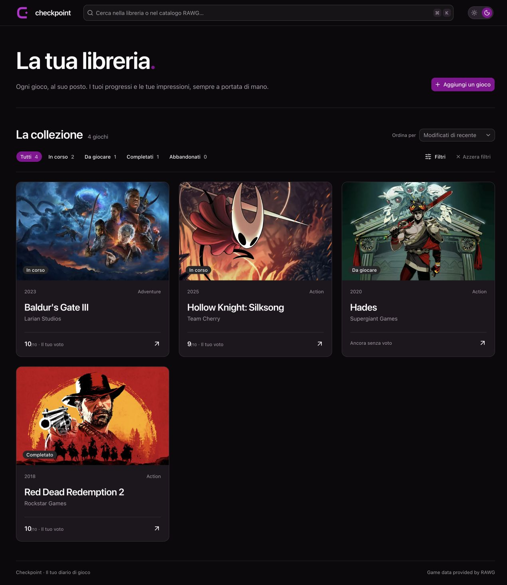
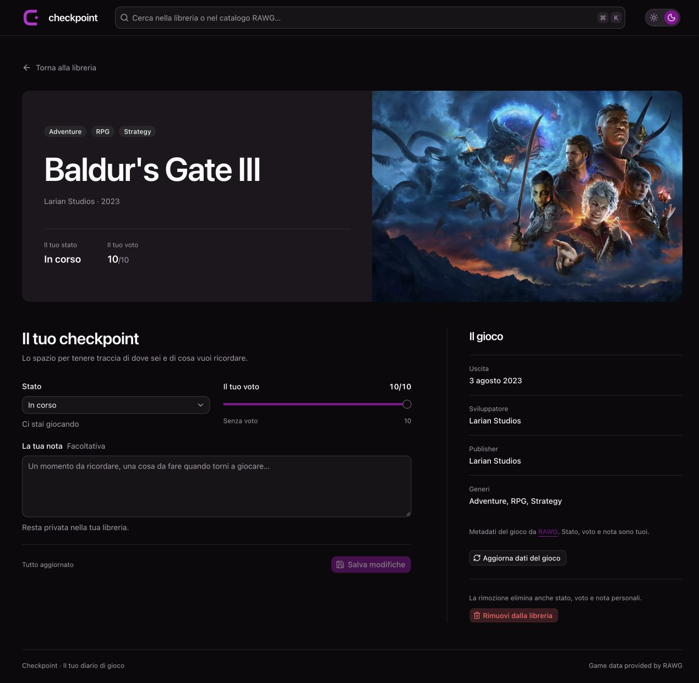
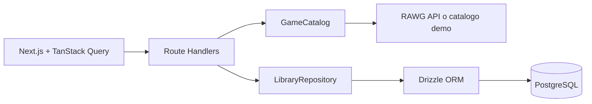

# Checkpoint

Checkpoint è un diario personale per videogiochi. Cerchi un gioco nel catalogo, lo aggiungi alla libreria e annoti stato, voto e note. Ogni gioco ha una sola voce personale.

Il progetto è un esercizio su [Effect](https://effect.website/). Le chiamate al catalogo, la validazione degli input e la persistenza passano attraverso programmi Effect con dipendenze ed errori espliciti.

## Demo

La configurazione predefinita usa un catalogo locale e una libreria in PostgreSQL. Non richiede API key o richieste esterne. Puoi cercare Hades, Celeste o Dead Cells e aggiungerli dalla pagina `/library`.





## Avvio rapido

Servono Node.js 20 o successivo, pnpm e Docker con Compose.

```bash
pnpm install --frozen-lockfile
pnpm setup
pnpm dev
```

Apri [http://localhost:3000](http://localhost:3000). `pnpm setup` crea `.env` da `.env.example`, avvia PostgreSQL, applica le migration e carica cinque voci dimostrative. Il seed è ripetibile.

```bash
pnpm test
pnpm typecheck
pnpm lint
pnpm check      # lint + typecheck + test
pnpm build
```

## Database Supabase

L'app usa Drizzle attraverso il `LibraryRepository` di Effect anche con Supabase. Per eseguirla su Vercel o su un altro runtime serverless:

1. Nel progetto Supabase, apri **Connect** e copia l'URI del **Transaction pooler** (porta `6543`). Sostituisci il segnaposto della password e codifica i caratteri speciali della password nell'URI.
2. Imposta l'URI come `DATABASE_URL` tra le variabili **server** dell'hosting. Non usare il prefisso `NEXT_PUBLIC_`: la connessione al database avviene solo nei Route Handler.
3. Crea `.env.supabase.local` nel repository con `DATABASE_URL` uguale all'URI del Transaction pooler e `DATABASE_MIGRATION_URL` uguale all'URI della **Direct connection**. Il file è ignorato da Git e non cambia il database usato da `pnpm dev`. Se la rete locale non supporta IPv6, usa l'URI del **Session pooler** (porta `5432`) per `DATABASE_MIGRATION_URL`.
4. Prima di avviare l'app ospitata, esegui `pnpm db:migrate:supabase` e poi `pnpm db:check:supabase`. Il primo comando applica le migration con TLS; il secondo legge la libreria tramite il `LibraryRepository` live. Non eseguire `pnpm db:seed` sul database remoto se vuoi iniziare senza i dati demo.

Il client limita a una connessione per istanza quando l'host è Supabase e richiede TLS. Il driver `pg` permette di usare il pooler transaction senza il pipelining di Postgres.js. La migration `0002_enable_rls` abilita RLS senza policy sulle sei tabelle dell'app: i ruoli `anon` e `authenticated` non possono leggere o modificare le voci personali, mentre la connessione PostgreSQL del server continua a funzionare. [Connessioni Supabase](https://supabase.com/docs/guides/database/connecting-to-postgres), [Sicurezza della Data API](https://supabase.com/docs/guides/api/securing-your-api).

Lo sviluppo locale continua a usare `DATABASE_URL` in `.env` e PostgreSQL in Docker. `pnpm setup` forza il database locale anche se hai una variabile di migrazione remota nell'ambiente. I test unitari usano il repository in memoria e partono con `pnpm test`; `pnpm test:db` avvia un PostgreSQL di test separato sulla porta `5433`, applica le migration e verifica il repository live. Nessuno dei due comandi di test usa Supabase.

Poiché l'app usa soltanto Drizzle, puoi disattivare la **Data API** nelle impostazioni API di Supabase. Il prototipo non ha autenticazione: se pubblichi l'app senza limitare l'accesso, chiunque raggiunga i suoi endpoint può modificare l'unica libreria personale. [Drizzle e Data API](https://supabase.com/docs/guides/database/drizzle).

## Catalogo RAWG

La demo usa `CATALOG_PROVIDER=fake`. Per cercare nel catalogo live, crea una API key dalla [documentazione RAWG](https://rawg.io/apidocs) e imposta queste variabili in `.env`:

```env
CATALOG_PROVIDER=live
RAWG_API_KEY=la-tua-chiave
```

Non committare `.env`. L'interfaccia mostra l'attribuzione RAWG quando usa il catalogo live.

## Funzionalità

- Una voce personale per gioco, con stato `backlog`, `playing`, `completed` o `abandoned`.
- Voto intero opzionale da 1 a 10 e una nota.
- Ricerca nel catalogo e aggiunta manuale alla libreria.
- Filtri per titolo, stato, genere, sviluppatore, editore e voto minimo.
- Ordinamento per ultimo aggiornamento, titolo, voto o data di uscita.

## Architettura


```mermaid
flowchart LR
  UI[Next.js + TanStack Query] --> API[Route Handlers]
  API --> Catalog[GameCatalog]
  API --> Library[LibraryRepository]
  Catalog --> Rawg[RAWG API o catalogo demo]
  Library --> Drizzle[Drizzle ORM]
  Drizzle --> Postgres[(PostgreSQL)]
```

Il codice applicativo è organizzato in `src/modules`; gli adapter e la configurazione sono in `src/infrastructure`. Il vocabolario è in [`CONTEXT.md`](CONTEXT.md), la specifica in [`docs/spec.md`](docs/spec.md) e le scelte di perimetro in [`docs/adr/`](docs/adr/).

### Come viene usato Effect

- `Context.Tag` dichiara `GameCatalog` e `LibraryRepository`.
- `Layer` sceglie gli adapter live, demo o in memoria.
- `Schema` decodifica input HTTP, configurazione e risposte RAWG.
- `Data.TaggedError` distingue errori del catalogo, del database e voci mancanti.
- `Effect.forEach` limita a quattro le richieste di dettaglio RAWG concorrenti.
- `Schedule` ritenta le richieste RAWG fallite con un limite.

TanStack Query gestisce query, mutation e invalidazione della cache nel browser. Effect gestisce i confini del server e le dipendenze dei programmi. Drizzle gestisce le query SQL; le interfacce dei repository restituiscono valori `Effect`.

## Decisioni

Il prototipo è single-user: non ha autenticazione o tabella utenti. La ricerca aggiorna gli snapshot locali dei giochi, ma non crea voci personali. Solo l'azione esplicita "Aggiungi" crea una voce in libreria. Se la voce esiste già, l'aggiunta non modifica stato, voto o nota.

L'importazione Steam e il tracciamento delle fonti di possesso sono stati rimossi per concentrare il progetto sul diario e sui flussi Effect ancora utili. La [decisione di perimetro](docs/adr/0001-focus-on-personal-library.md) documenta anche la migration che elimina le vecchie associazioni senza cancellare le voci personali.

## Test ed esercizi

I test coprono il repository in memoria e il confine HTTP. `pnpm check` esegue lint, typecheck e test. Le sei [schede di studio](exercises/README.md) propongono cambiamenti progressivi nei flussi di catalogo, libreria, configurazione e chiamate esterne.

## Uso dell'AI

Codex ha aiutato a esaminare il codice, restringere il perimetro e aggiornare implementazione e documenti. Le decisioni sul prodotto sono state confermate prima delle modifiche. Ho verificato il risultato con i controlli del repository.
