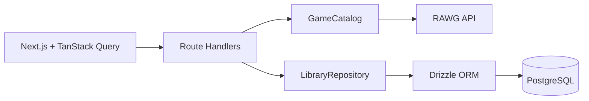

# Checkpoint

Checkpoint è un diario personale per videogiochi. Cerchi un gioco nel catalogo, lo aggiungi alla libreria e annoti stato, voto e note. Ogni gioco ha una sola voce personale.

Il progetto è un esercizio su [Effect](https://effect.website/). Le chiamate al catalogo, la validazione degli input e la persistenza passano attraverso programmi Effect con dipendenze ed errori espliciti.

## Sviluppo locale

L'app usa il catalogo RAWG e una libreria su Supabase. Per cercare giochi dalla pagina `/library` serve una chiave RAWG in `.env`. Il test didattico usa il repository in memoria senza credenziali o richieste esterne.


## Avvio rapido

Servono Node.js 22, pnpm e un progetto Supabase.

```bash
pnpm install --frozen-lockfile
cp .env.example .env
# Compila .env con le connessioni Supabase e RAWG_API_KEY.
pnpm setup
pnpm dev
```

Configura le connessioni come descritto sotto, poi apri [http://localhost:3000](http://localhost:3000). `pnpm setup` verifica la connessione a Supabase con una lettura della libreria. Le migration si applicano esplicitamente con `pnpm db:migrate`; il setup non inserisce dati dimostrativi.

```bash
pnpm test
pnpm typecheck
pnpm lint
pnpm check      # lint + typecheck + test
pnpm build
```

## Database Supabase

L'app usa Supabase anche durante lo sviluppo locale. Drizzle accede al database attraverso il `LibraryRepository` di Effect. Per configurare le connessioni:

1. Nel progetto Supabase, apri **Connect** e copia l'URI del **Transaction pooler** (porta `6543`). Sostituisci il segnaposto della password e codifica i caratteri speciali della password nell'URI.
2. Imposta l'URI come `DATABASE_URL` tra le variabili **server** dell'hosting. Non usare il prefisso `NEXT_PUBLIC_`: la connessione al database avviene solo nei Route Handler.
3. Configura `.env` nel repository con `DATABASE_URL` uguale all'URI del Transaction pooler e `DATABASE_MIGRATION_URL` uguale all'URI della **Direct connection**. Il file è ignorato da Git ed è usato sia da `pnpm dev` sia dagli script Supabase. Se la rete locale non supporta IPv6, usa l'URI del **Session pooler** (porta `5432`) per `DATABASE_MIGRATION_URL`.
4. Su un nuovo database, esegui `pnpm db:migrate` e poi `pnpm db:check:supabase`. `pnpm db:migrate:supabase` è un alias dello stesso comando di migrazione. Il primo comando applica le migration con TLS verificato; il secondo legge la libreria tramite il `LibraryRepository` live.

Il client limita a una connessione per istanza quando l'host è Supabase. Verifica la CA e il nome host usando il certificato pubblico `certs/supabase-ca.crt`, scaricato da **Database → Settings → Download certificate**; aggiorna questo file se Supabase ruota la CA. Il driver `pg` permette di usare il pooler transaction senza il pipelining di Postgres.js. La migration `0002_enable_rls` abilita RLS senza policy sulle sei tabelle dell'app: i ruoli `anon` e `authenticated` non possono leggere o modificare le voci personali, mentre la connessione PostgreSQL del server continua a funzionare. [Connessioni Supabase](https://supabase.com/docs/guides/database/connecting-to-postgres), [Sicurezza della Data API](https://supabase.com/docs/guides/api/securing-your-api).

Il progetto non richiede PostgreSQL locale o Docker. App e comandi database usano Supabase; gli script verificano che le URI puntino a Supabase e che le due connessioni di migrazione appartengano allo stesso progetto. Il test didattico usa il repository in memoria e parte con `pnpm test`, senza database o servizi esterni.

Le variabili dell'app sono descritte in `src/infrastructure/config.ts` con `Config` di Effect:

| Variabile                | Regola                                                                                                                                                           |
| ------------------------ | ---------------------------------------------------------------------------------------------------------------------------------------------------------------- |
| `DATABASE_URL`           | Obbligatoria alla prima operazione del repository live; punta al Transaction pooler Supabase sia nello sviluppo sia nell'app ospitata.                           |
| `DATABASE_MIGRATION_URL` | Usata da Drizzle Kit per le migration; se manca, usa `DATABASE_URL`. Lo script Supabase la richiede esplicitamente per evitare migration sul Transaction pooler. |
| `RAWG_API_KEY`           | Obbligatoria e non vuota nell'app: il catalogo live usa sempre RAWG.                                                                                             |

Le URL e la chiave RAWG sono valori `Redacted`: si leggono esplicitamente soltanto quando servono alla connessione o alla richiesta esterna. Next.js carica `.env` nello sviluppo locale; sull'hosting le variabili vanno configurate lato server. Il repository in memoria e il catalogo fake vengono forniti esplicitamente solo nei test.

Poiché l'app usa soltanto Drizzle, puoi disattivare la **Data API** nelle impostazioni API di Supabase. Il prototipo non ha autenticazione: se pubblichi l'app senza limitare l'accesso, chiunque raggiunga i suoi endpoint può modificare l'unica libreria personale. [Drizzle e Data API](https://supabase.com/docs/guides/database/drizzle).

## Catalogo RAWG

Per cercare nel catalogo, crea una API key dalla [documentazione RAWG](https://rawg.io/apidocs) e impostala in `.env`:

```env
RAWG_API_KEY=la-tua-chiave
```

Non committare `.env`. Senza chiave, le richieste API restituiscono un errore di configurazione. Il catalogo fake è disponibile come `Layer` nei test. L'interfaccia mostra l'attribuzione RAWG.

La ricerca usa una sola richiesta alla lista RAWG e restituisce fino a sei anteprime con titolo, copertina, data e generi. Quando scegli **Aggiungi**, il client invia l'ID: il server carica il dettaglio RAWG, inclusi sviluppatori ed editori, e salva lo snapshot nella libreria. Cercare non scrive nel database.

## Funzionalità

- Una voce personale per gioco, con stato `backlog`, `playing`, `completed` o `abandoned`.
- Voto intero opzionale da 1 a 10 e una nota.
- Ricerca nel catalogo e aggiunta manuale alla libreria.
- Filtri per titolo, stato, genere, sviluppatore, editore e voto minimo.
- Ordinamento per ultimo aggiornamento, titolo, voto o data di uscita.

## Architettura


```mermaid
flowchart LR
  UI[Next.js + TanStack Query] --> API[Route Handlers]
  API --> Catalog[GameCatalog]
  API --> Library[LibraryRepository]
  Catalog --> Rawg[RAWG API]
  Library --> Drizzle[Drizzle ORM]
  Drizzle --> Postgres[(PostgreSQL)]
```

Il codice applicativo è organizzato in `src/modules`; gli adapter e la configurazione sono in `src/infrastructure`. Il vocabolario è in [`CONTEXT.md`](CONTEXT.md), la specifica in [`docs/spec.md`](docs/spec.md) e le scelte di perimetro in [`docs/adr/`](docs/adr/).

### Come viene usato Effect

- `Context.Tag` dichiara `GameCatalog` e `LibraryRepository`.
- `Layer` fornisce gli adapter live all'app e quelli fake o in memoria ai test.
- `Schema` decodifica input HTTP, configurazione e risposte RAWG.
- `Data.TaggedError` distingue errori del catalogo, del database e voci mancanti.
- `Effect` separa la ricerca delle anteprime dal caricamento del dettaglio quando un gioco viene aggiunto.
- `Schedule` ritenta le richieste RAWG fallite con un limite.

TanStack Query gestisce query, mutation e invalidazione della cache nel browser. Effect gestisce i confini del server e le dipendenze dei programmi. Drizzle gestisce le query SQL; le interfacce dei repository restituiscono valori `Effect`.

Il dettaglio del catalogo è una lettura: può mostrare una copertina mancante senza richiedere PostgreSQL o aggiornare uno snapshot. L'aggiunta compone il caricamento da RAWG con `LibraryRepository.addManualGame`; l'adapter PostgreSQL salva snapshot e voce personale nella stessa transazione e restituisce l'ID della voce. La transazione appartiene all'adapter perché `Effect` descrive la sequenza e gli errori, ma non rende atomiche da solo due scritture SQL.

Aggiungere di nuovo un gioco già presente restituisce la stessa voce senza cambiare i metadati salvati. Nella scheda della libreria, **Aggiorna dati del gioco** ricarica esplicitamente i metadati RAWG e conserva stato, voto e nota.

La politica di filtri e ordinamento vive in `src/modules/library/query.ts`. Browser e due adapter la usano con le stesse regole; l'adapter PostgreSQL carica le voci e i metadati con tre query, indipendentemente dal numero di voci.

## Decisioni

Il prototipo è single-user: non ha autenticazione o tabella utenti. La ricerca non salva giochi locali né crea voci personali. Solo l'azione esplicita "Aggiungi" crea una voce in libreria con metadati completi. Se la voce esiste già, l'aggiunta non modifica stato, voto o nota.

L'importazione Steam e il tracciamento delle fonti di possesso sono stati rimossi per concentrare il progetto sul diario e sui flussi Effect ancora utili. La [decisione di perimetro](docs/adr/0001-focus-on-personal-library.md) documenta anche la migration che elimina le vecchie associazioni senza cancellare le voci personali.

## Test ed esercizi

Resta un solo file di test, `src/modules/library/repository-memory.test.ts`, come esempio per studiare Effect. Mostra la composizione con `Effect.gen`, la dipendenza dichiarata tramite `Context.Tag`, la fornitura del repository con `Effect.provide`, gli errori tipizzati con `Effect.flip` e l'isolamento dello stato tra istanze del `Layer`. La suite non cerca di coprire tutta l'applicazione. `pnpm check` esegue lint, typecheck e test. Le sei [schede di studio](exercises/README.md) propongono cambiamenti progressivi nei flussi di catalogo, libreria, configurazione e chiamate esterne.

## Uso dell'AI

Codex ha aiutato a esaminare il codice, restringere il perimetro e aggiornare implementazione e documenti. Le decisioni sul prodotto sono state confermate prima delle modifiche. Ho verificato il risultato con i controlli del repository.
