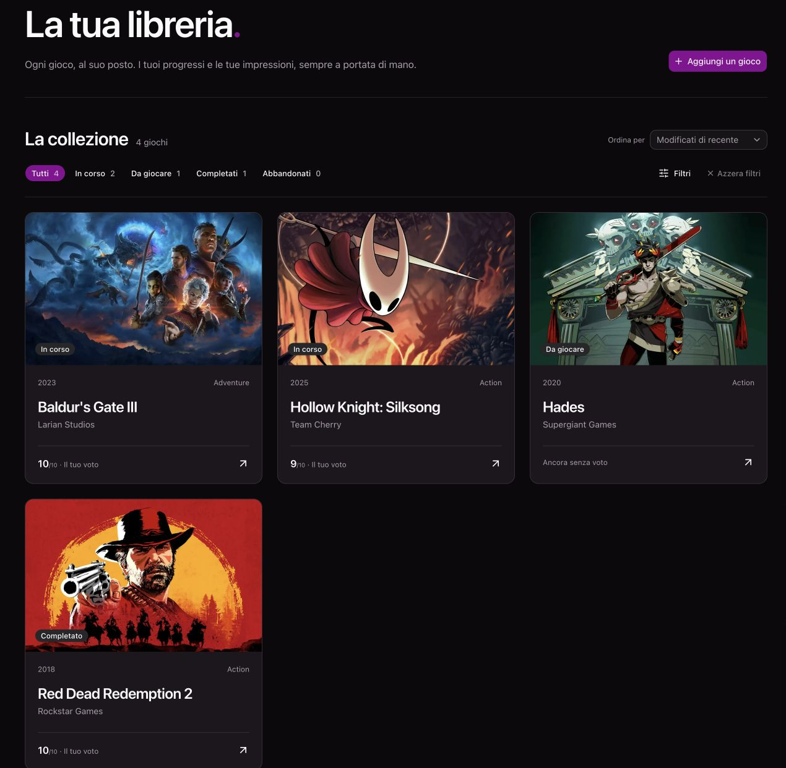
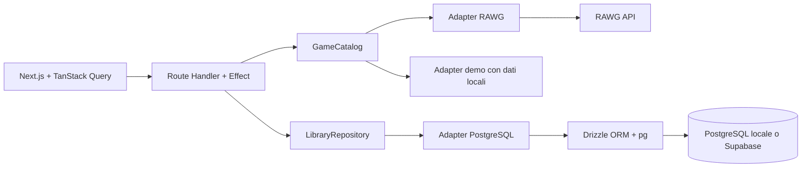

<h1>
  <a href="https://checkpoint-green-one.vercel.app">
    
  </a>
  
  checkpoint
</h1>

Checkpoint è un diario personale per videogiochi. Cerchi un gioco nel catalogo, lo aggiungi alla libreria e annoti stato, voto e nota.

La versione online è disponibile su [checkpoint-green-one.vercel.app](https://checkpoint-green-one.vercel.app).

## Perché questo progetto

Sono appassionato di videogiochi e ho scelto un dominio familiare per iniziare a studiare [Effect](https://effect.website/). Cercare in un catalogo esterno, validare dati e salvare una voce personale mi sembravano operazioni adatte a esplorare la libreria in un'applicazione concreta.

Prima di questo progetto conoscevo Effect solo di nome, soprattutto per la gestione degli errori. L'obiettivo era costruire un piccolo progetto che la utilizzasse e rendere visibile il mio percorso di apprendimento attraverso il codice e le scelte tecniche.

Ho mantenuto il dominio contenuto per dedicare attenzione a Effect e alla separazione tra contratti dei servizi e adapter. L'app è un prototipo single-user; autenticazione e integrazioni aggiuntive sono rimaste fuori dal perimetro.

<table>
  <tr>
    <td width="50%">
      
    </td>
    <td width="50%">
      
    </td>
  </tr>
</table>

## Avvio rapido

Requisiti:

- Node.js 22
- pnpm
- Docker avviato, con Docker Compose disponibile

```bash
pnpm install
pnpm setup
pnpm dev
```

`pnpm setup` prepara l'ambiente locale (vedi [setup.sh](scripts/setup.sh)):

1. Crea `.env` con i valori locali, se il file non esiste.
2. Avvia PostgreSQL su `localhost:5433` tramite Docker Compose.
3. Applica le migration al database.
4. Inserisce quattro voci dimostrative, se la libreria è vuota.

### Variabili d'ambiente

| Variabile                | Uso                                                                                                   |
| ------------------------ | ----------------------------------------------------------------------------------------------------- |
| `DATABASE_URL`           | Connessione al database locale o al Transaction pooler Supabase.                                      |
| `DATABASE_MIGRATION_URL` | Connessione per le migration. In locale può essere omessa; con Supabase è obbligatoria.               |
| `RAWG_API_KEY`           | Seleziona il catalogo RAWG. Senza chiave, in locale viene usato il demo; con Supabase è obbligatoria. |

Per usare RAWG in locale è necessario aggiungere la chiave `RAWG_API_KEY` a `.env`. La chiave si ottiene registrandosi su [https://rawg.io/apidocs](https://rawg.io/apidocs).

### Giochi ricercabili nel catalogo demo

Senza chiave RAWG, l'app usa il catalogo demo che comprende questi 20 giochi:

- Baldur's Gate III
- Celeste
- Cyberpunk 2077
- Dark Souls III
- Dead Cells
- Disco Elysium
- Elden Ring
- Hades
- Hollow Knight
- Outer Wilds
- Portal
- Portal 2
- Red Dead Redemption 2
- Sekiro: Shadows Die Twice
- Slay the Spire
- Stardew Valley
- Terraria
- The Elder Scrolls V: Skyrim
- The Witcher 3: Wild Hunt
- Undertale

L'elenco è definito in [`src/modules/catalog/demo-data.ts`](src/modules/catalog/demo-data.ts). `GameCatalogDemo` fornisce il servizio `GameCatalog` tramite un `Layer` di Effect: ricerca e dettaglio usano lo stesso contratto dell'adapter RAWG, con dati locali deterministici.

## Struttura del progetto

L'albero mostra le cartelle principali e alcuni file da cui iniziare la lettura.

```text
checkpoint/
├── src/
│   ├── app/                       Pagine Next.js e Route Handler HTTP
│   │   └── api/                   Endpoint del catalogo e della libreria
│   ├── modules/
│   │   ├── catalog/               Modelli, contratto GameCatalog, adapter RAWG e demo,
│   │   │                          dati demo e hook TanStack Query
│   │   └── library/               Modelli, contratto LibraryRepository e adapter
│   │                              PostgreSQL e in memoria, filtri, hook e test didattici
│   ├── infrastructure/            Configurazione, composizione dei Layer e confine HTTP
│   │   └── database/              Client PostgreSQL, schema Drizzle e validazione
│   │                              della destinazione del database
│   ├── components/                Interfaccia dell'applicazione
│   │   └── ui/                    Componenti shadcn/ui
│   ├── lib/                       Client API e utilità di navigazione
│   └── styles/                    Stili globali
├── public/                        Risorse statiche
├── drizzle/                       Migration SQL e metadati Drizzle
├── scripts/                       Setup e comandi per PostgreSQL locale e Supabase
├── compose.yaml                   PostgreSQL locale con volume persistente
├── certs/                         Certificato CA per la connessione Supabase
├── docs/                          Documentazione, decisioni di architettura,
│                                  convenzioni per gli assistenti AI e materiali grafici
├── .agents/skills/                Skill installate nel progetto
├── .impeccable/                   Configurazione e materiali di design e revisione
│                                  dell'interfaccia prodotti con Impeccable
├── AGENTS.md                      Istruzioni di repository per gli assistenti AI
├── CLAUDE.md                      Rimando ad AGENTS.md per Claude Code
├── CONTEXT.md                     Vocabolario del dominio
├── CODING_STANDARDS.md            Convenzioni di codice
├── PRODUCT.md                     Indicazioni di prodotto
└── DESIGN.md                      Indicazioni per l'interfaccia
```

Per seguire Effect nel codice, suggerisco questo ordine di lettura:

1. [`scripts/database.ts`](scripts/database.ts): l'inizializzazione dell'ambiente e del database. Usa Effect per coordinare configurazione, avvio di PostgreSQL locale, migration e dati dimostrativi, gestendo gli errori dei comandi.
2. [`src/modules/`](src/modules): i moduli del catalogo e della libreria. Contengono modelli, contratti dei servizi, errori e adapter, oltre agli hook per il client e ai test.
3. [`src/infrastructure/`](src/infrastructure): la configurazione e la composizione dell'app. Legge e valida le variabili d'ambiente, fornisce i servizi tramite i `Layer` e gestisce l'accesso al database e la conversione dei risultati e degli errori in risposte HTTP.
4. [`src/app/api/`](src/app/api): i flussi esposti dalle API.

## Architettura


```mermaid
flowchart LR
  UI[Next.js + TanStack Query] --> API[Route Handler + Effect]
  API --> Catalog[GameCatalog]
  API --> Library[LibraryRepository]
  Catalog --> RawgAdapter[Adapter RAWG]
  Catalog --> Demo[Adapter demo con dati locali]
  RawgAdapter --> Rawg[RAWG API]
  Library --> Repository[Adapter PostgreSQL]
  Repository --> Drizzle[Drizzle ORM + pg]
  Drizzle --> Postgres[(PostgreSQL locale o Supabase)]
```

I modelli, i contratti dei servizi e i relativi adapter sono organizzati in `src/modules`. `src/infrastructure` contiene la configurazione, la composizione dei `Layer`, il confine HTTP e l'accesso al database.

`app-layer.ts` fornisce le implementazioni ai programmi dei Route Handler in base alla configurazione:

- Con PostgreSQL locale e senza chiave RAWG, usa il catalogo demo con dati e copertine inclusi nel repository.
- Con PostgreSQL locale e una chiave RAWG, usa il catalogo RAWG.
- Con Supabase, usa il catalogo RAWG e richiede la chiave.

La libreria dell'app è sempre persistita in PostgreSQL, anche usando il catalogo demo. L'adapter in memoria è usato nei test ed è escluso dal diagramma. La scelta del catalogo avviene nella composizione dei `Layer`: i flussi applicativi continuano a richiedere lo stesso servizio `GameCatalog`.

### Servizi e adapter

La separazione tra servizi e adapter si può leggere attraverso questi file:

1. I file `service.ts` di [catalogo](src/modules/catalog/service.ts) e [libreria](src/modules/library/service.ts) definiscono le operazioni disponibili e i possibili errori. `Context.Tag` identifica il servizio che un programma può richiedere.
2. Per il catalogo, [`rawg-live.ts`](src/modules/catalog/rawg-live.ts) chiama RAWG, mentre [`demo.ts`](src/modules/catalog/demo.ts) usa dati locali. Entrambi forniscono il servizio `GameCatalog`.
3. Per la libreria, [`repository-live.ts`](src/modules/library/repository-live.ts) usa Drizzle e PostgreSQL; [`repository-memory.ts`](src/modules/library/repository-memory.ts) conserva i dati in memoria per i test. Entrambi forniscono `LibraryRepository`.
4. [`app-layer.ts`](src/infrastructure/app-layer.ts) compone le implementazioni usate dall'app. I `Layer` collegano i contratti agli adapter; i programmi richiedono i servizi senza scegliere come accedere ai dati.
5. [`repository-memory.test.ts`](src/modules/library/repository-memory.test.ts) mostra questa separazione in uso: il test compone aggiunta, aggiornamento e lettura di una voce, fornendo il repository in memoria senza collegarsi al database.

Ho scelto questa struttura per studiare dipendenze ed errori in Effect. Richiede contratti e composizione espliciti anche per un'app piccola evidenziandone i flussi e le interazioni.

## Uso dell'AI e percorso di apprendimento

Ho chiesto all'AI di creare un primo impianto del progetto su cui studiare Effect, indicando come vincoli l'organizzazione in moduli funzionali, l'uso di TanStack Query per la cache e un ruolo centrale per Effect.

Ho poi chiesto una code review e fatto trasformare i rilievi in esercizi, invece di applicare direttamente le correzioni. Ho risolto gli esercizi personalmente e sottoposto le soluzioni all'assistente per la correzione. Questo mi ha permesso di studiare Effect lavorando sui problemi del progetto, con un riscontro sulle soluzioni e sulle mie motivazioni.

Conclusa la fase di studio ed esercitazione, ho iniziato a sviluppare l'applicazione vera e propria seguendo il metodo con cui uso l'AI anche nel mio lavoro quotidiano:

1. Discussione delle scelte con l'assistente, usando la skill `grill-with-docs` per definire il lavoro e documentare le decisioni.
2. Implementazione con la skill `implement`, sulla base di quanto definito.
3. Code review svolta da me, con il supporto delle evidenze raccolte durante l'implementazione.

`grill-with-docs` e `implement` fanno parte delle [skill di AI Hero](https://www.aihero.dev/skills). Per il lavoro sull'interfaccia ho usato soprattutto [Impeccable](https://impeccable.style/). Le skill usate sono conservate in `.agents/skills`; le istruzioni e la documentazione del repository hanno fornito agli assistenti il contesto del progetto e l'obiettivo di apprendimento.

## Cosa ho imparato e cosa approfondirei

Il progetto mi ha dato una prima comprensione di Effect, soprattutto nella gestione degli errori e delle dipendenze. La sintassi richiede pratica, ma la difficoltà maggiore resta l'ampiezza dell'ecosistema: capire quali strumenti usare richiede tempo.

In generale, Effect mi sembra offrire una buona esperienza di sviluppo, aiutando a organizzare il codice in parti indipendenti. Trovo interessante la distinzione tra servizi (`Context`), che descrivono le capacità disponibili, e adapter (`Layer`), che ne forniscono le implementazioni. Permette di cambiare il comportamento di un programma sostituendo gli adapter, senza riscrivere il flusso delle operazioni. Trovo utile anche la distinzione tra errori previsti, dichiarati nei tipi e gestibili dal programma, e difetti inattesi: aiuta a rendere espliciti i fallimenti da considerare nel flusso applicativo.

## Cosa approfondirei con più tempo

Vorrei approfondire [ManagedRuntime](https://effect.website/docs/v3/runtime#managedruntime) per capire come gestire i servizi di Effect nel ciclo di vita di un framework come Next.js, che uso quotidianamente. Mi interessa anche la [configurazione in Effect](https://effect.website/docs/v3/configuration) avendo avuto esperienza nello sviluppo di applicazioni multitenant, vorrei capire se la libreria possa semplificarne la composizione e la validazione mantenendo leggibili le configurazioni.
